class: center, middle, hide-logo

```{r setup, include=FALSE}
options(htmltools.dir.version = FALSE)
```

<div class="my-logo-left"></div>
<div class="my-logo-right"></div>

# Current Advancements in Deep Reinforcement Learning
### Daten in software-intensiven technischen Systemen - Modellierung - Analyse - Schutz
#### Henrik Hain<br>Supervisor: Dipl.-Ing. D. Zimmermann
#### Institute for Program Structures and Data Organisation
#### `r Sys.Date()`

---
# Table of Contents

.left-column[
### Contents
]

.right-column[
### 1. Recent Breakthroughs

### 2. Reinforcement Learning & Deep Learning

### 3 .Deep Reinforcement Learning

### 4. Selected Advancements

### 5. Conclusion and Outlook
] 

<div class="my-footer"><span>`r Sys.Date()` - Henrik Hain - Current Advancements in Deep Reinforcement Learning</span></div>

---
class: center, middle, inverse

# Recent Breakthroughs

--

## "AI equals reinforcement learning plus deep learning." - [D. Silver]

--

## "Deep reinforcement learning is poised to revolutionalize the field of artificial intelligence [...]." - [K. Arulkuraman]

---
# Recent Breakthrough

.left-column[
### 2019 AlphaStar
]

.right-column[
.right[
<br>
Image: <a href="https://deepmind.com/blog/article/alphastar-mastering-real-time-strategy-game-starcraft-ii">Google DeepMind</a>]
]

<div class="my-footer"><span>`r Sys.Date()` - Henrik Hain - Current Advancements in Deep Reinforcement Learning</span></div>

???
- Plays the RTS StarCraft II on raw visual input
- Problem Dimensions
  - Imperfect Information Game
  - Large Action Space
  - Involves Long Term Planning
- Ranks Above 99.8% of all players
- Uses Combinations of RL, Heuristical Search, ...

---
# Recent Breakthrough

.left-column[
### 2019 AlphaStar

### 2018 Rubik's Cube
]

.right-column[
.right[
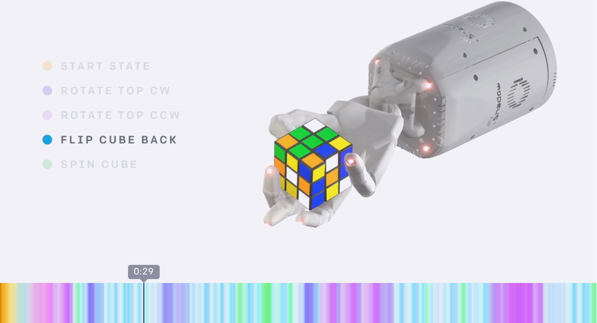<br>Image: <a href="https://openai.com/blog/solving-rubiks-cube/">OpenAI</a>
]
]

<div class="my-footer"><span>`r Sys.Date()` - Henrik Hain - Current Advancements in Deep Reinforcement Learning</span></div>

???
- Plays Chess, Shogi and go at expert program level
- True RL successor to AlphaGo
- Problem Dimensions
  - Perfect Information Game
  - Search Space Sice
  - Position Evaluation

---
# Recent Breakthrough

.left-column[
### 2019 AlphaStar

### 2018 Rubik's Cube

### 2017 AlphaZero
]

.right-column[

.right[
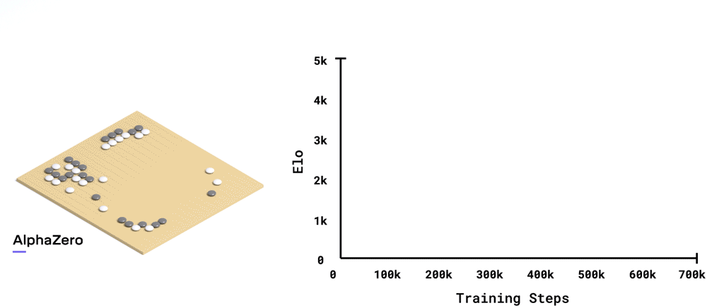<br>Image: <a href="https://deepmind.com/blog/article/alphazero-shedding-new-light-grand-games-chess-shogi-and-go">Google DeepMind</a>
]
]

<div class="my-footer"><span>`r Sys.Date()` - Henrik Hain - Current Advancements in Deep Reinforcement Learning</span></div>

---
class: center, middle, inverse

# Reinforcement Learning & Deep Learning

---
# Reinforcement Learning

.left-column[
### Overview
]

.right-column[
An Agent interacts with an environment $E$ in discrete timesteps. At each timestep $t$ the agent receives an observation $s_t$, takes an action $a_t$ and receives a scalar reward $r_t$.
.right[
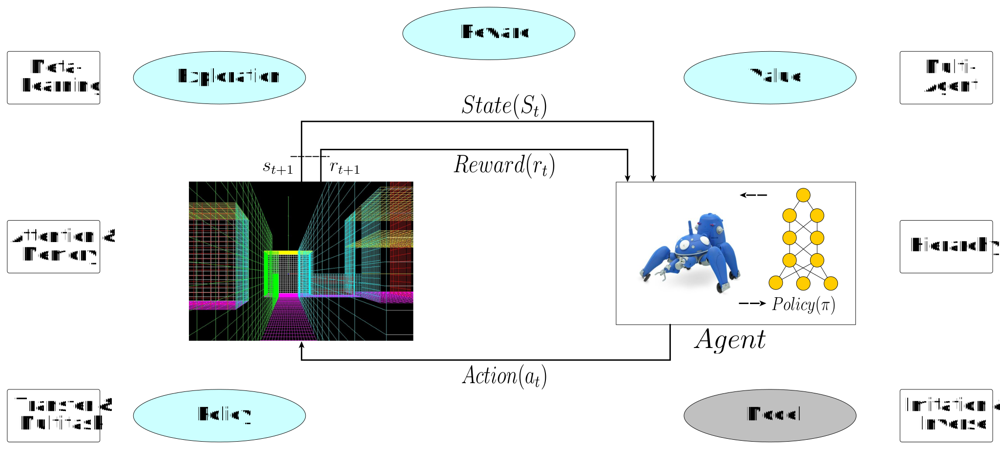
]
Formalized as Markov descision processes (MDP).
]

<div class="my-footer"><span>`r Sys.Date()` - Henrik Hain - Current Advancements in Deep Reinforcement Learning</span></div>

---
# Reinforcement Learning

.left-column[
### Overview

### Policy

]

.right-column[
A policy defines an agents behavior at a given time.
.right[
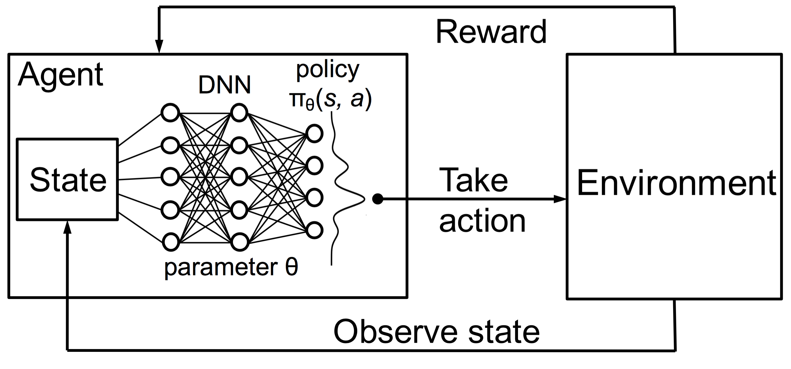
]
A policy $\pi$ maps states to a probability distribution over actions $\pi:S \rightarrow P(A)$.
]

<div class="my-footer"><span>`r Sys.Date()` - Henrik Hain - Current Advancements in Deep Reinforcement Learning</span></div>

---
# Reinforcement Learning

.left-column[
### Overview

### Policy

### Reward & Value
]

.right-column[
The reward defines the goal of a reinforcment learning problem. On each time step, the environment emmits a scalar reward value.
.right[
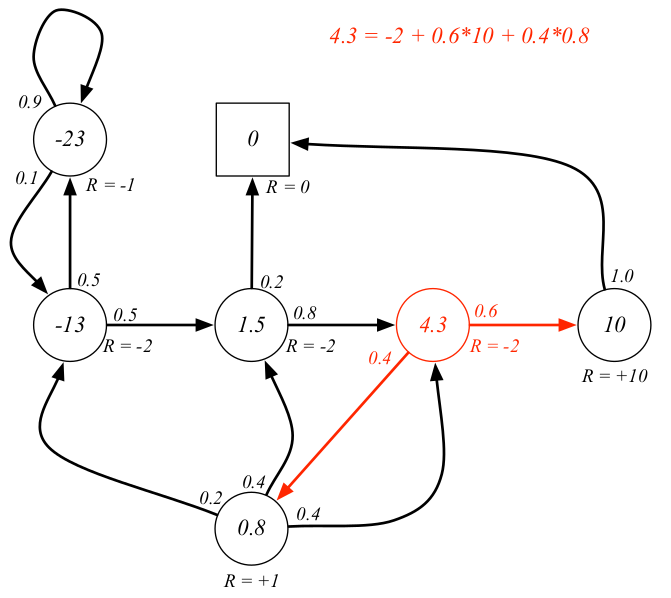
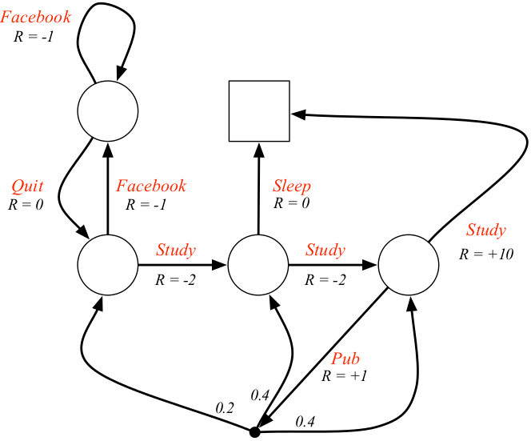
<br>Images: <a href="https://www.google.com/url?sa=t&rct=j&q=&esrc=s&source=web&cd=13&ved=2ahUKEwjIsKPe7ujoAhVM26QKHQG2BhwQFjAMegQIBRAB&url=https%3A%2F%2Fwww.davidsilver.uk%2Fwp-content%2Fuploads%2F2020%2F03%2FMDP.pdf&usg=AOvVaw2G8xS6pXLns1mo_vKVQmE3">David Silver</a>
]
A value function specifies long-term desirabilities. The state value is defined as the sum of discounted expected future rewards $R_t=\sum_{i=t}^{T}\gamma^{(i-t)}r(s_i,a_i)$.
]

<div class="my-footer"><span>`r Sys.Date()` - Henrik Hain - Current Advancements in Deep Reinforcement Learning</span></div>

---
# Reinforcement Learning

.left-column[
### Overview

### Policy

### Reward & Value

### Exploration

]

.right-column[
The problem of balancing exploration and exploitation can be formalized using so-called multi-armed bandit problems.
<br>

<br>
Multi-armed bandits are a reduced, non-associative case of the 'complete' reinforcement learning problem.
]

<div class="my-footer"><span>`r Sys.Date()` - Henrik Hain - Current Advancements in Deep Reinforcement Learning</span></div>

---
# Reinforcement Learning

.left-column[
### Overview

### Policy

### Reward & Value

### Exploration
]

.right-column[
Balancing exploration and exploitation using an $\epsilon$-greedy action selection.
.right[
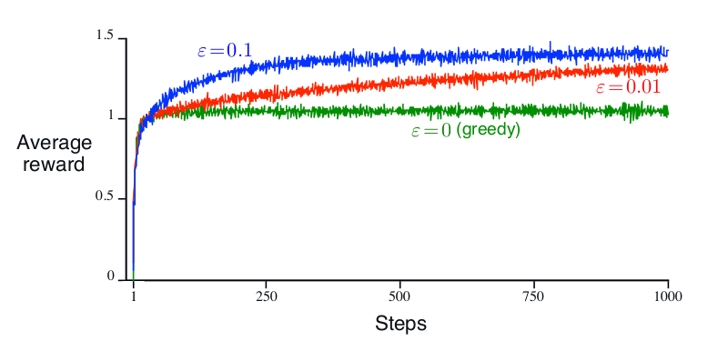
]
$\epsilon$-greedy: Select greedy action with probability $1-\epsilon$, else select at random.
]

<div class="my-footer"><span>`r Sys.Date()` - Henrik Hain - Current Advancements in Deep Reinforcement Learning</span></div>

---
# Reinforcement Learning

.left-column[
### Overview

### Policy

### Reward & Value

### Exploration

### [Model]
]

.right-column[
An [optional] reinforcement learning model mimics environmental dynamics, enabling usage of optimal control and planning methods.
.right[
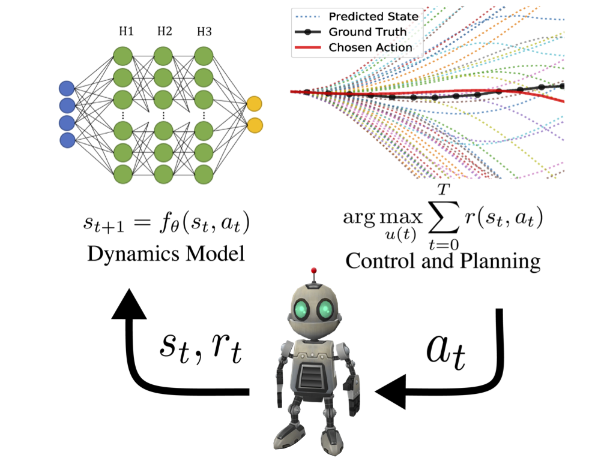
<br>Image: <a href="https://arxiv.org/abs/1901.03737">Nathan Lambert</a>
]

]

<div class="my-footer"><span>`r Sys.Date()` - Henrik Hain - Current Advancements in Deep Reinforcement Learning</span></div>

---
# Deep Learning

.left-column[
### Why?

]

.right-column[
Deep neural networks (DNN) excel in automatic hierarchical representation learning as well as function approximation, usually outperforming competing approaches.
.right[
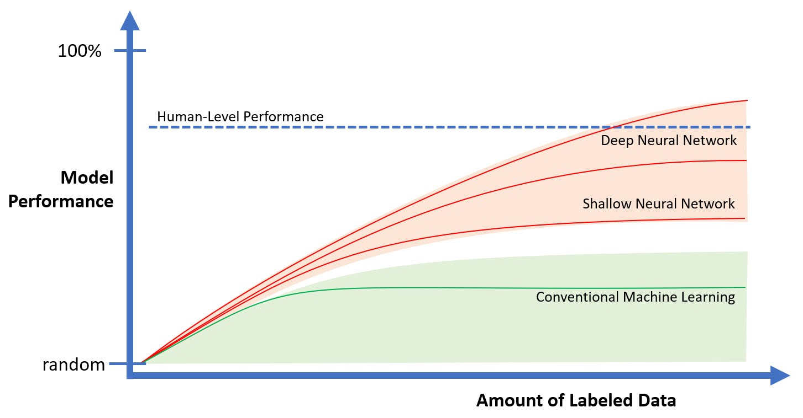<br>Image: <a href="https://towardsdatascience.com/how-managers-should-prepare-for-deep-learning-new-values-f29a98b70bd8">Richard Hackathorn</a>
]
]

<div class="my-footer"><span>`r Sys.Date()` - Henrik Hain - Current Advancements in Deep Reinforcement Learning</span></div>

---
# Deep Learning

.left-column[
### Why?

### Overview

]

.right-column[
Apart from established, application domain specific standard architecture patterns, neural network architectures provide a high degree of flexibility.
.right[
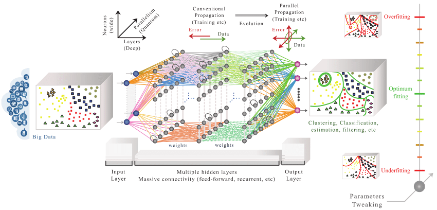<br>Image: <a href="https://www.researchgate.net/publication/332219159_Quantum_Machine_Learning_for_6G_Communication_Networks_State-of-the-Art_and_Vision_for_the_Future">Junaid Nawaz et al.</a>
]

]

.left[


]

<div class="my-footer"><span>`r Sys.Date()` - Henrik Hain - Current Advancements in Deep Reinforcement Learning</span></div>

---
# Deep Learning

.left-column[
### Why?

### Overview

### Elements

]

.right-column[
Deep neural networks are neural networks consisting of multiple hidden layers, usually used for learning feature hierarchies.
.right[
    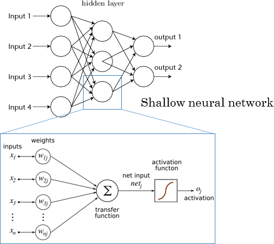
    
<br>Image: <a href="https://www.rsipvision.com/exploring-deep-learning/">www.rsipvision.com</a>

]

]

<div class="my-footer"><span>`r Sys.Date()` - Henrik Hain - Current Advancements in Deep Reinforcement Learning</span></div>

---
# Deep Learning

.left-column[
### Why?

### Overview

### Elements

### Example

]

.right-column[
Deep Q-Network (DQN) processing schematic and network attention saliency map of a trained DQN playing Space Invaders on an Atari 2600. 
.right[
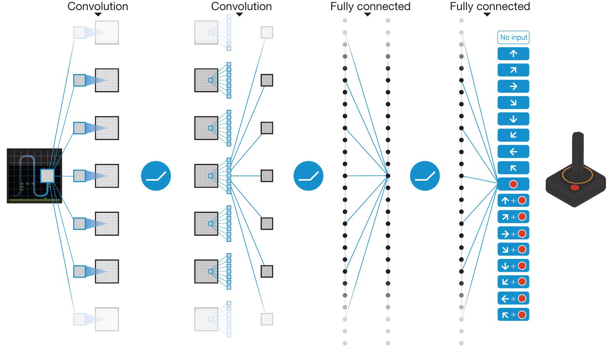
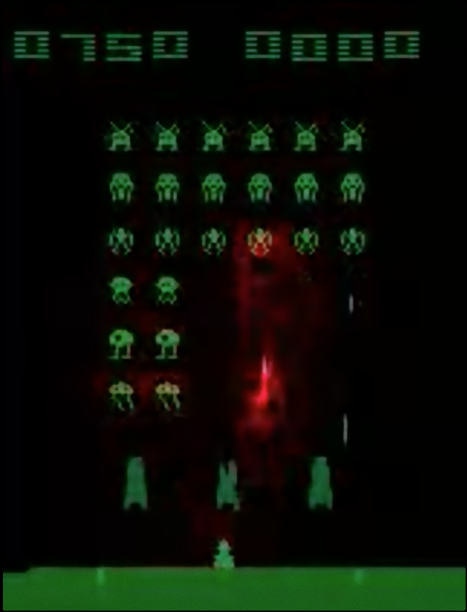
<br>Images: <a href="https://www.nature.com/articles/nature14236">Mnih et al.</a>
]
]

<div class="my-footer"><span>`r Sys.Date()` - Henrik Hain - Current Advancements in Deep Reinforcement Learning</span></div>

---
class: center, middle, inverse

# Deep Reinforcement Learning

## Areas, Research, and Applications

---
# Deep Reinforcement Learning

.left-column[
### Overview

]

.right-column[
OpenAI key research areas.
.right[

]
]

<div class="my-footer"><span>`r Sys.Date()` - Henrik Hain - Current Advancements in Deep Reinforcement Learning</span></div>

---
# Deep Reinforcement Learning

.left-column[
### Overview

### Areas

]

.right-column[
OpenAI key research areas citation counts.
.right[
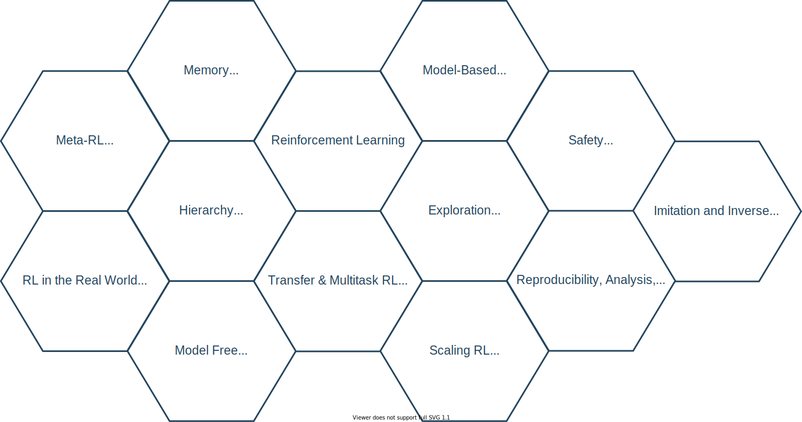
]
]

<div class="my-footer"><span>`r Sys.Date()` - Henrik Hain - Current Advancements in Deep Reinforcement Learning</span></div>

---
# Deep Reinforcement Learning

.left-column[
### Overview

### Areas

### Research

]

.right-column[
Top 5 most influential research papers according to citation counts.
<br><br><br>
<style type="text/css">
.tg  {border-collapse:collapse;border-spacing:0;border-color:#9ABAD9;}
.tg td{font-family:Arial, sans-serif;font-size:14px;padding:10px 5px;border-style:solid;border-width:0px;overflow:hidden;word-break:normal;border-top-width:1px;border-bottom-width:1px;border-color:#9ABAD9;color:#444;background-color:#EBF5FF;}
.tg th{font-family:Arial, sans-serif;font-size:14px;font-weight:normal;padding:10px 5px;border-style:solid;border-width:0px;overflow:hidden;word-break:normal;border-top-width:1px;border-bottom-width:1px;border-color:#9ABAD9;color:#fff;background-color:#409cff;}
.tg .tg-phtq{background-color:#D2E4FC;border-color:inherit;text-align:left;vertical-align:top}
.tg .tg-f48y{font-family:"Lucida Sans Unicode", "Lucida Grande", sans-serif !important;;border-color:inherit;text-align:left;vertical-align:top}
.tg .tg-0pky{border-color:inherit;text-align:left;vertical-align:top}
</style>
<table class="tg">
  <tr>
    <th class="tg-f48y">Year</th>
    <th class="tg-0pky">Cited By</th>
    <th class="tg-0pky">Title</th>
    <th class="tg-0pky">Author</th>
    <th class="tg-0pky">Area</th>
  </tr>
  <tr>
    <td class="tg-phtq">2013</td>
    <td class="tg-phtq">3401</td>
    <td class="tg-phtq">Playing Atari with Deep Reinforcement Learning</td>
    <td class="tg-phtq">Mnih et al.</td>
    <td class="tg-phtq">Model-Free/Deep Q<br></td>
  </tr>
  <tr>
    <td class="tg-0pky">2015</td>
    <td class="tg-0pky">2707</td>
    <td class="tg-0pky">Continuous Control With Deep Reinforcement Learning</td>
    <td class="tg-0pky">Lillicrap et al.</td>
    <td class="tg-0pky">Model-Free/DPG</td>
  </tr>
  <tr>
    <td class="tg-phtq">2016<br></td>
    <td class="tg-phtq">2634</td>
    <td class="tg-phtq">Asynchronous Methods for Deep Reinforcement Learning</td>
    <td class="tg-phtq">Mnih et al.</td>
    <td class="tg-phtq">Model-Free/PG</td>
  </tr>
  <tr>
    <td class="tg-0pky">2015<br></td>
    <td class="tg-0pky">1788</td>
    <td class="tg-0pky">Trust Region Policy Optimization Algorithms</td>
    <td class="tg-0pky">Schulman et al.</td>
    <td class="tg-0pky">Model-Free/PG</td>
  </tr>
  <tr>
    <td class="tg-phtq">2015</td>
    <td class="tg-phtq">1599</td>
    <td class="tg-phtq">Deep Reinforcement Learning with Double Q-learning</td>
    <td class="tg-phtq">Hasselt et al.</td>
    <td class="tg-phtq">Model-Free/Deep Q</td>
  </tr>
</table>
]

<div class="my-footer"><span>`r Sys.Date()` - Henrik Hain - Current Advancements in Deep Reinforcement Learning</span></div>

---
class: center, middle, inverse

# Selected Advancements

---
# Selected Advancements

.left-column[
### Double Q-learning
]

.right-column[
Deep Reinforcement Learning with Double Q-learning
.pull-left[
- Both standard Q-learning and DQN use the same operator for action selection and evaluation.
- Prone to overestimation action values
- splitting argmax operator in action selection and evaluation
- Reduces overestimation of expected values
]
.pull-right[
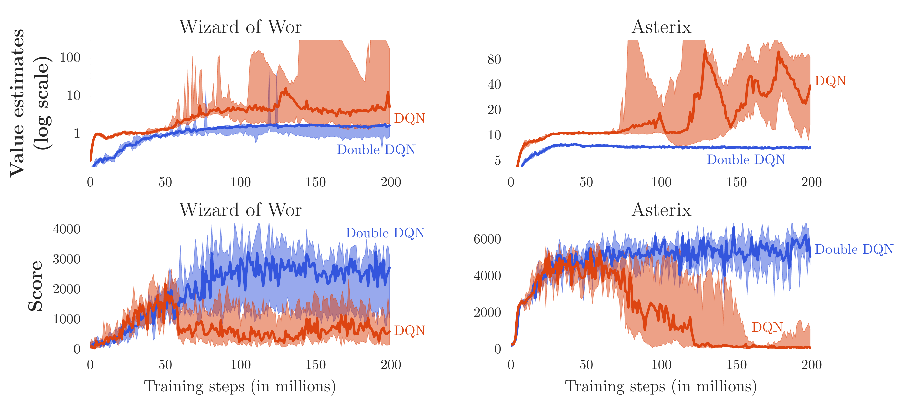<br>Image: <a href="https://arxiv.org/abs/1509.06461">Hasselt et al.</a>
]
]

<div class="my-footer"><span>`r Sys.Date()` - Henrik Hain - Current Advancements in Deep Reinforcement Learning</span></div>

---
# Selected Advancements

.left-column[
### Double Q-learning

### Continuous Control
]

.right-column[
Continuous Control With Deep Reinforcement Learning
.pull-left[
- Many tasks have continuous, high dimensional action spaces
- Discretizing action space intractable with DQN
- Adapts DQN for continuous control tasks

]
.pull-right[
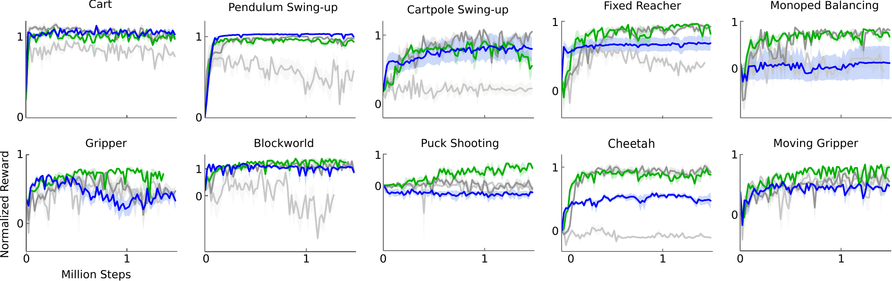<br>Images: <a href="https://arxiv.org/abs/1509.02971">Lillicrap et al.</a>
]
]


<div class="my-footer"><span>`r Sys.Date()` - Henrik Hain - Current Advancements in Deep Reinforcement Learning</span></div>

---
# Selected Advancements

.left-column[
### Double Q-learning

### Continuous Control

### Asynchronous Methods
]

.right-column[
.right[
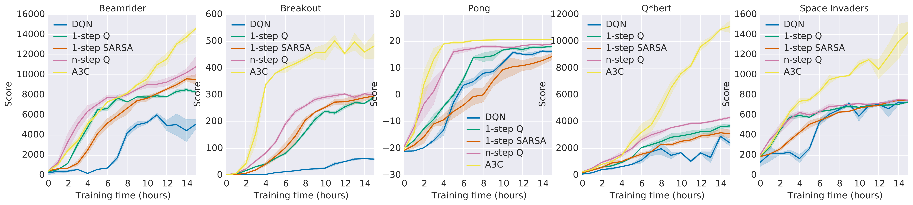<br><br>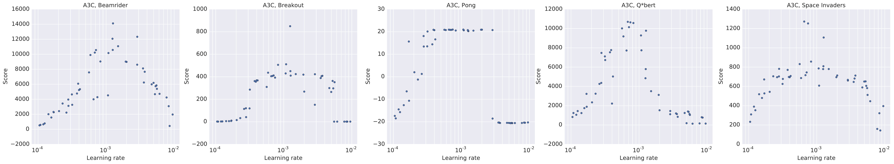<br>Images: <a href="https://arxiv.org/abs/1509.06461">Mnih et al.</a>
]
]

<div class="my-footer"><span>`r Sys.Date()` - Henrik Hain - Current Advancements in Deep Reinforcement Learning</span></div>

---
# Selected Advancements

.left-column[
### Double Q-learning

### Continuous Control

### Asynchronous Methods

### Proximal Policy Optimization
]

.right-column[
.right[
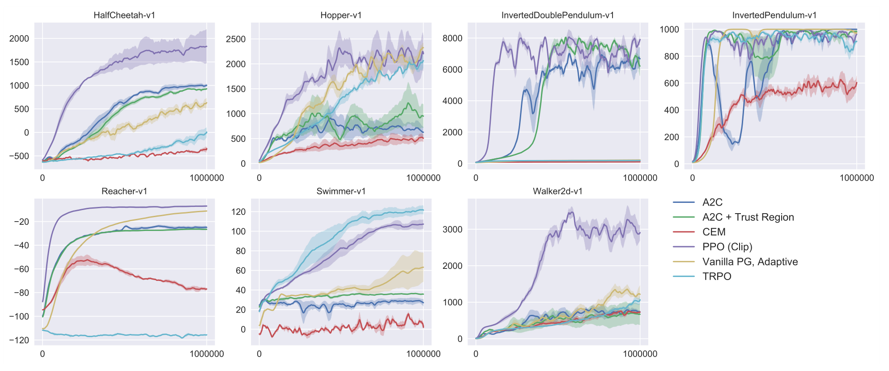<br>Image: <a href="https://arxiv.org/abs/1707.06347">Schulman et al.</a>
]
]

<div class="my-footer"><span>`r Sys.Date()` - Henrik Hain - Current Advancements in Deep Reinforcement Learning</span></div>

---
# Selected Advancements

.left-column[
### Double Q-learning

### Continuous Control

### Asynchronous Methods

### Proximal Policy Optimization

### Meta-Learning
]

.right-column[
.right[
<br>Image: <a href="https://bair.berkeley.edu/blog/2017/07/18/learning-to-learn/">Berkeley</a>
]
]

<div class="my-footer"><span>`r Sys.Date()` - Henrik Hain - Current Advancements in Deep Reinforcement Learning</span></div>

---
# Conclusion and Outlook

.left-column[

]

.right-column[

]

<div class="my-footer"><span>`r Sys.Date()` - Henrik Hain - Current Advancements in Deep Reinforcement Learning</span></div>

---
class: center, middle
# Thanks!
