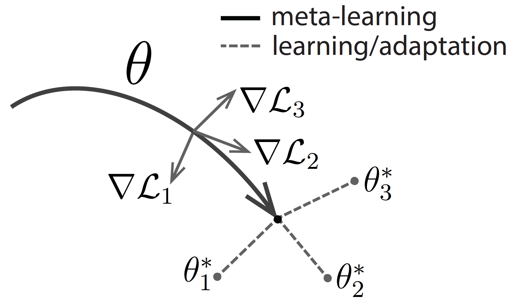

class: center, middle, hide-logo

```{r setup, include=FALSE}
options(htmltools.dir.version = FALSE)
```

<div class="my-logo-left"></div>
<div class="my-logo-right"></div>

# Current Advancements in Deep Reinforcement Learning
### Daten in software-intensiven technischen Systemen - Modellierung - Analyse - Schutz
#### Henrik Hain<br>Supervisor: Dipl.-Ing. D. Zimmermann
#### Institute for Program Structures and Data Organisation
#### `r Sys.Date()`

---
# Table of Contents

.left-column[
### Contents
]

.right-column[
### 1. Recent Breakthroughs

### 2. Reinforcement Learning & Deep Learning

### 3. Deep Reinforcement Learning

### 4. Selected Advancements

### 5. Conclusion and Outlook
] 

<div class="my-footer"><span>`r Sys.Date()` - Henrik Hain - Current Advancements in Deep Reinforcement Learning</span></div>

---
class: center, middle, inverse

# Recent Breakthroughs

--

## "AI equals reinforcement learning plus deep learning." - [D. Silver]

--

## "Deep reinforcement learning is poised to revolutionalize the field of artificial intelligence [...]." - [K. Arulkuraman]

---
# Recent Breakthrough

.left-column[
### 2019 AlphaStar
]

.right-column[
.right[
<br>
Image: <a href="https://deepmind.com/blog/article/alphastar-mastering-real-time-strategy-game-starcraft-ii">Google DeepMind</a>]
]

<div class="my-footer"><span>`r Sys.Date()` - Henrik Hain - Current Advancements in Deep Reinforcement Learning</span></div>

???
- Plays the RTS StarCraft II on raw visual input
- Problem Dimensions
  - Imperfect Information Game
  - Large Action Space
  - Involves Long Term Planning
- Ranks Above 99.8% of all players
- Uses Combinations of RL, Heuristical Search, ...

---
# Recent Breakthrough

.left-column[
### 2019 AlphaStar

### 2018 Rubik's Cube
]

.right-column[
.right[
<br>Image: <a href="https://openai.com/blog/solving-rubiks-cube/">OpenAI</a>
]
]

<div class="my-footer"><span>`r Sys.Date()` - Henrik Hain - Current Advancements in Deep Reinforcement Learning</span></div>

???
- Plays Chess, Shogi and go at expert program level
- True RL successor to AlphaGo
- Problem Dimensions
  - Perfect Information Game
  - Search Space Sice
  - Position Evaluation

---
# Recent Breakthrough

.left-column[
### 2019 AlphaStar

### 2018 Rubik's Cube

### 2017 AlphaZero
]

.right-column[

.right[
<br>Image: <a href="https://deepmind.com/blog/article/alphazero-shedding-new-light-grand-games-chess-shogi-and-go">Google DeepMind</a>
]
]

<div class="my-footer"><span>`r Sys.Date()` - Henrik Hain - Current Advancements in Deep Reinforcement Learning</span></div>

---
class: center, middle, inverse

# Reinforcement Learning & Deep Learning

---
# Reinforcement Learning

.left-column[
### Overview
]

.right-column[
Perception-action loop discrete timestep interaction
.right[

]
Typically formalized as Markov descision processes (MPD's)
]

<div class="my-footer"><span>`r Sys.Date()` - Henrik Hain - Current Advancements in Deep Reinforcement Learning</span></div>

---
# Reinforcement Learning

.left-column[
### Overview

### Policy

]

.right-column[
A policy defines an agents behavior at a given time
.right[

]
Policy $\pi$ maps states to a probability distribution over actions $\pi:S \rightarrow P(A)$.
]

<div class="my-footer"><span>`r Sys.Date()` - Henrik Hain - Current Advancements in Deep Reinforcement Learning</span></div>

---
# Reinforcement Learning

.left-column[
### Overview

### Policy

### Reward & Value
]

.right-column[
Reinforcement learning goal $\rightarrow$ reward maximization
.right[


<br>Images: <a href="https://www.google.com/url?sa=t&rct=j&q=&esrc=s&source=web&cd=13&ved=2ahUKEwjIsKPe7ujoAhVM26QKHQG2BhwQFjAMegQIBRAB&url=https%3A%2F%2Fwww.davidsilver.uk%2Fwp-content%2Fuploads%2F2020%2F03%2FMDP.pdf&usg=AOvVaw2G8xS6pXLns1mo_vKVQmE3">David Silver</a>
]
State value $\rightarrow$ sum of discounted expected future rewards $R_t=\sum_{i=t}^{T}\gamma^{(i-t)}r(s_i,a_i)$.
]

<div class="my-footer"><span>`r Sys.Date()` - Henrik Hain - Current Advancements in Deep Reinforcement Learning</span></div>

---
# Reinforcement Learning

.left-column[
### Overview

### Policy

### Reward & Value

### Exploration

]

.right-column[
Exploration vs. exploitation formalized as multi-armed bandit problem
<br>

<br>
Multi-armed bandits $\rightarrow$ non-associative reinforcement learning
]

<div class="my-footer"><span>`r Sys.Date()` - Henrik Hain - Current Advancements in Deep Reinforcement Learning</span></div>

---
# Reinforcement Learning

.left-column[
### Overview

### Policy

### Reward & Value

### Exploration
]

.right-column[
Balance exploration vs. exploitation $\rightarrow$ $\epsilon$-greedy action selection
.right[

]
Select greedily with probability $1-\epsilon$, else randomly
]

<div class="my-footer"><span>`r Sys.Date()` - Henrik Hain - Current Advancements in Deep Reinforcement Learning</span></div>

---
# Reinforcement Learning

.left-column[
### Overview

### Policy

### Reward & Value

### Exploration

### [Model]
]

.right-column[
[Optional] model mimicing environmental dynamics $\rightarrow$ optimal control / planning
.right[

<br>Image: <a href="https://arxiv.org/abs/1901.03737">Nathan Lambert</a>
]

]

<div class="my-footer"><span>`r Sys.Date()` - Henrik Hain - Current Advancements in Deep Reinforcement Learning</span></div>

---
# Deep Learning

.left-column[
### Why?

]

.right-column[
Deep neural networks (DNN) $\rightarrow$ representation learning, function approximation, scaling
.right[
<br>Image: <a href="https://towardsdatascience.com/how-managers-should-prepare-for-deep-learning-new-values-f29a98b70bd8">Richard Hackathorn</a>
]
]

<div class="my-footer"><span>`r Sys.Date()` - Henrik Hain - Current Advancements in Deep Reinforcement Learning</span></div>

---
# Deep Learning

.left-column[
### Why?

### Overview

]

.right-column[
Deep neural networks (DNN) -> high flexibility + domain specific standard realizations
.right[
<br>Image: <a href="https://www.researchgate.net/publication/332219159_Quantum_Machine_Learning_for_6G_Communication_Networks_State-of-the-Art_and_Vision_for_the_Future">Junaid Nawaz et al.</a>
]

]

.left[


]

<div class="my-footer"><span>`r Sys.Date()` - Henrik Hain - Current Advancements in Deep Reinforcement Learning</span></div>

---
# Deep Learning

.left-column[
### Why?

### Overview

### Elements

]

.right-column[
DNN are stacked neural network $\rightarrow$ exploitating feature hierarchies 
.right[
    
    
<br>Image: <a href="https://www.rsipvision.com/exploring-deep-learning/">www.rsipvision.com</a>

]

]

<div class="my-footer"><span>`r Sys.Date()` - Henrik Hain - Current Advancements in Deep Reinforcement Learning</span></div>

---
# Deep Learning

.left-column[
### Why?

### Overview

### Elements

### Example

]

.right-column[
Deep Q-Network (DQN) $\rightarrow$ convolutional neural network + fully connected action predictor
.right[


<br>Images: <a href="https://www.nature.com/articles/nature14236">Mnih et al.</a>
]
]

<div class="my-footer"><span>`r Sys.Date()` - Henrik Hain - Current Advancements in Deep Reinforcement Learning</span></div>

---
class: center, middle, inverse

# Deep Reinforcement Learning

## Areas, Research, and Applications

---
# Deep Reinforcement Learning

.left-column[
### Overview

]

.right-column[
Research areas
.right[

]
]

<div class="my-footer"><span>`r Sys.Date()` - Henrik Hain - Current Advancements in Deep Reinforcement Learning</span></div>

---
# Deep Reinforcement Learning

.left-column[
### Overview

### Areas

]

.right-column[
Citation counts / research area
.right[

]
]

<div class="my-footer"><span>`r Sys.Date()` - Henrik Hain - Current Advancements in Deep Reinforcement Learning</span></div>

---
# Deep Reinforcement Learning

.left-column[
### Overview

### Areas

### Research

]

.right-column[
Research of influence - Top 5
<style type="text/css">
.tg  {border-collapse:collapse;border-spacing:0;border-color:#9ABAD9;}
.tg td{font-family:Arial, sans-serif;font-size:14px;padding:10px 5px;border-style:solid;border-width:0px;overflow:hidden;word-break:normal;border-top-width:1px;border-bottom-width:1px;border-color:#9ABAD9;color:#444;background-color:#EBF5FF;}
.tg th{font-family:Arial, sans-serif;font-size:14px;font-weight:normal;padding:10px 5px;border-style:solid;border-width:0px;overflow:hidden;word-break:normal;border-top-width:1px;border-bottom-width:1px;border-color:#9ABAD9;color:#fff;background-color:#409cff;}
.tg .tg-phtq{background-color:#D2E4FC;border-color:inherit;text-align:left;vertical-align:top}
.tg .tg-f48y{font-family:"Lucida Sans Unicode", "Lucida Grande", sans-serif !important;;border-color:inherit;text-align:left;vertical-align:top}
.tg .tg-0pky{border-color:inherit;text-align:left;vertical-align:top}
</style>
<table class="tg" width="100%">
  <tr>
    <th class="tg-f48y">Year</th>
    <th class="tg-0pky">Cited By</th>
    <th class="tg-0pky">Title</th>
    <th class="tg-0pky">Author</th>
    <th class="tg-0pky">Area</th>
  </tr>
  <tr>
    <td class="tg-phtq">2013</td>
    <td class="tg-phtq">3401</td>
    <td class="tg-phtq">Playing Atari with Deep Reinforcement Learning</td>
    <td class="tg-phtq">Mnih et al.</td>
    <td class="tg-phtq">Model-Free/Deep Q<br></td>
  </tr>
  <tr>
    <td class="tg-0pky">2015</td>
    <td class="tg-0pky">2707</td>
    <td class="tg-0pky">Continuous Control With Deep Reinforcement Learning</td>
    <td class="tg-0pky">Lillicrap et al.</td>
    <td class="tg-0pky">Model-Free/DPG</td>
  </tr>
  <tr>
    <td class="tg-phtq">2016<br></td>
    <td class="tg-phtq">2634</td>
    <td class="tg-phtq">Asynchronous Methods for Deep Reinforcement Learning</td>
    <td class="tg-phtq">Mnih et al.</td>
    <td class="tg-phtq">Model-Free/PG</td>
  </tr>
  <tr>
    <td class="tg-0pky">2015<br></td>
    <td class="tg-0pky">1788</td>
    <td class="tg-0pky">Trust Region Policy Optimization Algorithms</td>
    <td class="tg-0pky">Schulman et al.</td>
    <td class="tg-0pky">Model-Free/PG</td>
  </tr>
  <tr>
    <td class="tg-phtq">2015</td>
    <td class="tg-phtq">1599</td>
    <td class="tg-phtq">Deep Reinforcement Learning with Double Q-learning</td>
    <td class="tg-phtq">Hasselt et al.</td>
    <td class="tg-phtq">Model-Free/Deep Q</td>
  </tr>
</table>
]

<div class="my-footer"><span>`r Sys.Date()` - Henrik Hain - Current Advancements in Deep Reinforcement Learning</span></div>

---
class: center, middle, inverse

# Selected Advancements

### Double Q-learning, Continuous Control, Asynchronous Methods, Proximal Policy Optimization, Model-Agnostic Meta-Learning

---
# Selected Advancements

.left-column[
### Double Q-learning
]

.right-column[
Split $argmax$ operator $\rightarrow$ action selection, action evaluation
.right[
<br>Image: <a href="https://arxiv.org/abs/1509.06461">Hasselt et al.</a>
]
]

<div class="my-footer"><span>`r Sys.Date()` - Henrik Hain - Current Advancements in Deep Reinforcement Learning</span></div>

---
# Selected Advancements

.left-column[
### Double Q-learning

### Continuous Control
]

.right-column[
Deterministic policy gradient actor-critic approach to address continuous action spaces
.right[
<br>Images: <a href="https://arxiv.org/abs/1509.02971">Lillicrap et al.</a>
]
]


<div class="my-footer"><span>`r Sys.Date()` - Henrik Hain - Current Advancements in Deep Reinforcement Learning</span></div>

---
# Selected Advancements

.left-column[
### Double Q-learning

### Continuous Control

### Asynchronous Methods
]

.right-column[
Framework enabling _superlinear_ speedup with increasing number of threads (A3C)
.right[
<br><br><br>Images: <a href="https://arxiv.org/abs/1509.06461">Mnih et al.</a>
]
]

<div class="my-footer"><span>`r Sys.Date()` - Henrik Hain - Current Advancements in Deep Reinforcement Learning</span></div>

---
# Selected Advancements

.left-column[
### Double Q-learning

### Continuous Control

### Asynchronous Methods

### Proximal Policy Optimization
]

.right-column[
Enables end-to-end training via sampling from action probailities and policy rollouts
.right[
<br>Image: <a href="https://arxiv.org/abs/1707.06347">Schulman et al.</a>
]
]

<div class="my-footer"><span>`r Sys.Date()` - Henrik Hain - Current Advancements in Deep Reinforcement Learning</span></div>

---
# Selected Advancements

.left-column[
### Double Q-learning

### Continuous Control

### Asynchronous Methods

### Proximal Policy Optimization

### Meta-Learning
]

.right-column[
Achieve fast learning on new tasks by providing _good_ parameter initialization
.right[
<br>Image: <a href="https://bair.berkeley.edu/blog/2017/07/18/learning-to-learn/">Berkeley</a>
]
]

<div class="my-footer"><span>`r Sys.Date()` - Henrik Hain - Current Advancements in Deep Reinforcement Learning</span></div>

---
# Conclusion and Outlook

Deep reinforcement learning is a thriving and brimming field

Many large and small advancements in quick succession

Simple, but smart, ideas seem to achieve the greatest success

Current research mostly concentrated on model-free methods

Reinforcement learning can be used beneficial in almost every area!

<div class="my-footer"><span>`r Sys.Date()` - Henrik Hain - Current Advancements in Deep Reinforcement Learning</span></div>

---
class: center, middle, inverse
# Thank You!

---
# Links & References

Deepmind, Google (2019, January 24). _AlphaStar: Mastering the Real-Time Strategy Game StarCraft II._ Retrieved from [https://deepmind.com/blog/article/alphastar-mastering-real-time-strategy-game-starcraft-ii](https://deepmind.com/blog/article/alphastar-mastering-real-time-strategy-game-starcraft-ii).

OpenAI, (2019, October 15). _Solving Rubik's Cube with a Robot Hand._ Retrieved from [https://openai.com/blog/solving-rubiks-cube/](https://openai.com/blog/solving-rubiks-cube/).

Deepmind, Google (2018, December 6). _AlphaZero: Shedding new light on chess, shogi, and Go._ Retrieved from [https://deepmind.com/blog/article/alphazero-shedding-new-light-grand-games-chess-shogi-and-go](https://deepmind.com/blog/article/alphazero-shedding-new-light-grand-games-chess-shogi-and-go).

UCL Course, David Silver (2015, January 1). _Markov Decision Processes._ Retrieved from [https://www.davidsilver.uk/wp-content/uploads/2020/03/MDP.pdf](https://www.davidsilver.uk/wp-content/uploads/2020/03/MDP.pdf).

Lambert, Nathan et al. (2019, January 11). _Low Level Control of a Quadrotor with Deep Model-Based Reinforcement Learning._ Retrieved from [Low Level Control of a Quadrotor with Deep Model-Based Reinforcement Learning](Low Level Control of a Quadrotor with Deep Model-Based Reinforcement Learning).

Hackathorn, Richard. (2018, August 20). _How Managers Should Prepare for Deep Learning: New Values._ Retrieved from [https://towardsdatascience.com/how-managers-should-prepare-for-deep-learning-new-values-f29a98b70bd8](https://towardsdatascience.com/how-managers-should-prepare-for-deep-learning-new-values-f29a98b70bd8).

Junaid Nawaz, Syed et al. (2019, April 1). _Quantum Machine Learning for 6G Communication Networks: State-of-the-Art and Vision for the Future._ Retrieved from [https://ieeexplore.ieee.org/document/8681450](https://ieeexplore.ieee.org/document/8681450).

<div class="my-footer"><span>`r Sys.Date()` - Henrik Hain - Current Advancements in Deep Reinforcement Learning</span></div>

---
# Literature References

Mnih, Volodymyr et al. (2013, December 19). _Playing Atari with Deep Reinforcement Learning._ Retrieved from [https://arxiv.org/abs/1312.5602](https://arxiv.org/abs/1312.5602).

Lillicrap, Timothy P. (2015, September 9). _Continuous Control With Deep Reinforcement Learning._ Retrieved from [https://arxiv.org/abs/1509.02971](https://arxiv.org/abs/1509.02971).

Mnih, Volodymyr et al. (2016, February 4). _Asynchronous Methods for Deep Reinforcement Learning._ Retrieved from [https://arxiv.org/abs/1602.01783](https://arxiv.org/abs/1602.01783).

Schulman, John et al. (2015, February 19). _Trust Region Policy Optimization Algorithms._ Retrieved from [https://arxiv.org/abs/1502.05477](https://arxiv.org/abs/1502.05477).

Hasselt, Hado van et al. (2015, September 22). _Deep Reinforcement Learning with Double Q-learning._ Retrieved from [https://arxiv.org/abs/1509.06461](https://arxiv.org/abs/1509.06461).

Finn, Chelsea et al. (2017, March 9). _Model-Agnostic Meta-Learning for Fast Adaptation of Deep Networks._ Retrieved from [https://arxiv.org/abs/1703.03400](https://arxiv.org/abs/1703.03400).

<div class="my-footer"><span>`r Sys.Date()` - Henrik Hain - Current Advancements in Deep Reinforcement Learning</span></div>
